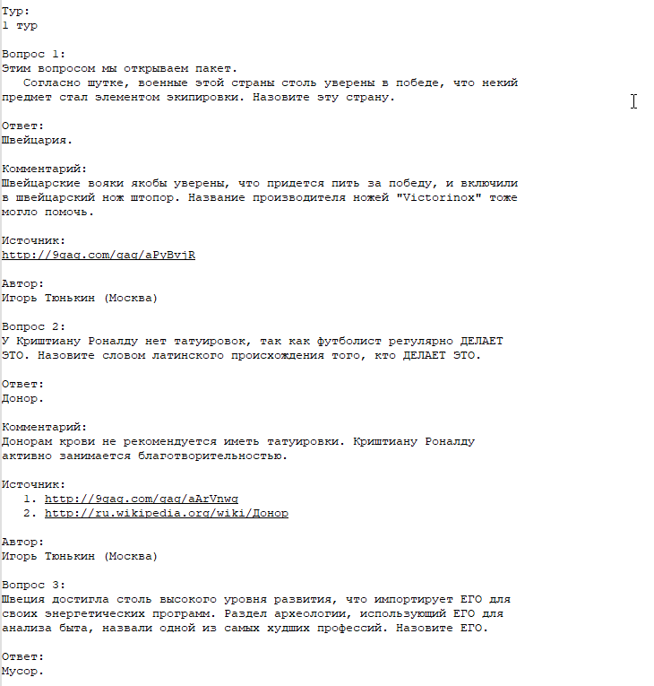
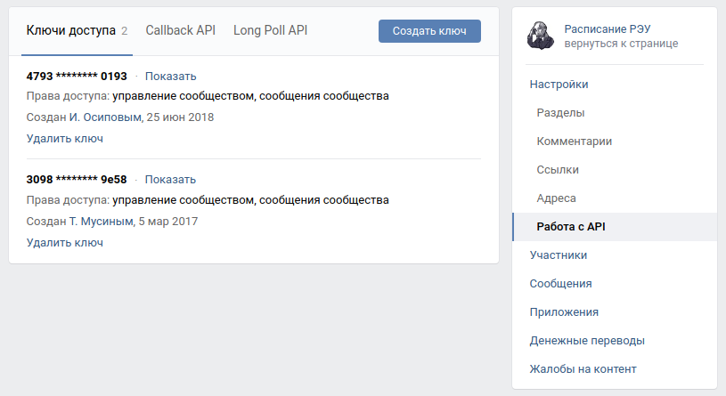
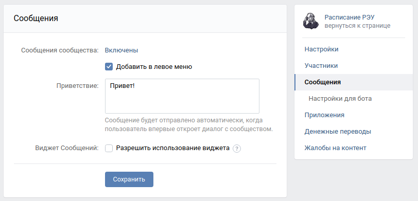

# Quiz bot

This project contains two bots (Telegram and VK) to play quiz game - answering a questions from base.

In current version:
- Collect questions from files
- Running [Telegram](https://telegram.org/) and [VK](https://vk.com/) bots
- Send questions to user
- Check answers

Bots using [Redis](https://redis.io/) to save users asked questions

## How to start

### Create `.env` file

It must contain variables for bots working

```
QUESTIONS_DIR = *path*        # path to directory with *.txt files with questions from quiz

TG_TOKEN = *bot token*        # token of your tg-bot

VK_ACCESS_TOKEN = *vk token*  # token from your vk group

REDIS_HOST = *redis host*     # redis database settings
REDIS_PORT = *redis port*
REDIS_PASSWORD = *redis database password*
```

1. Question dir - directory must contain txt files with questions in `KOI8-R`-code and special format:

    

2. Tg token - Help with obtain TG-Token: [Bot Father](https://telegram.me/BotFather)

3. Vk token - create API-token in your VK group and allow it to send messages


4. Redis variables - create account and database at [Redis](https://redis.io/) to get

### Run the bots

Use console to run bot locally:

```commandline
python tg_quiz_pot.py   # run tg bot

python vk_quiz_bot.py   # run vk bot
```
